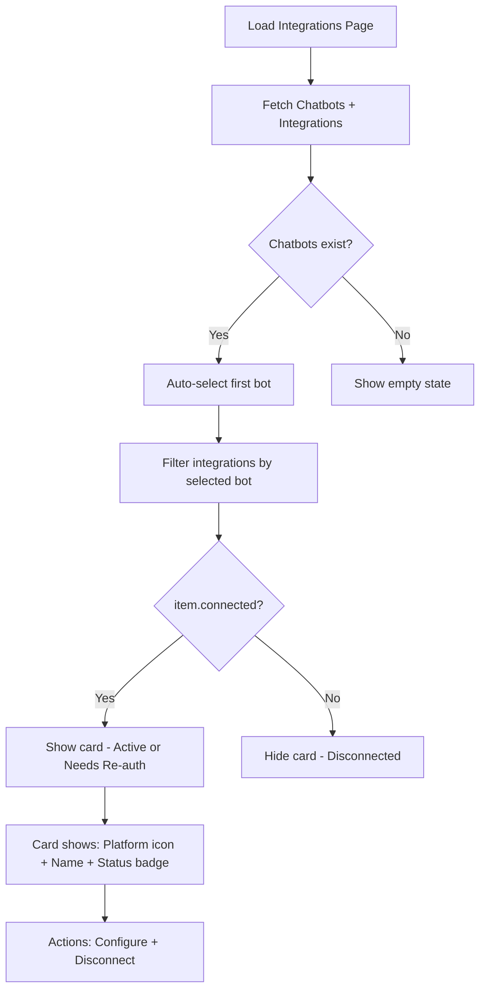

# Integration Page UI Cleanup Plan

## Overview

Integrations page-এ ৩টি UX পরিবর্তন প্রয়োজন:

1. **"All Bots (Workspace)" ডিফল্ট রিমুভ** — ডিফল্টভাবে প্রথম উপলব্ধ চ্যাটবট সিলেক্ট থাকবে
2. **"Assigned Agent" ড্রপডাউন রিমুভ** — প্রতিটি কার্ড থেকে এই ড্রপডাউন সরিয়ে দেওয়া
3. **শুধু কানেক্টেড প্ল্যাটফর্ম দেখানো** — "Disconnected" স্ট্যাটাসের কার্ড লুকানো

---

## Change 1: Default to First Bot (Remove "All Bots")

### Current Behavior
- `selectedBotFilter` defaults to `"all"` → shows "All Bots (Workspace)"
- Dropdown has "All Bots" + individual bot options

### Target Behavior
- Default to first available chatbot after data loads
- If no chatbots exist → empty state (no filter, no cards)
- Dropdown shows only individual bot options (no "All Bots")

### Code Changes

**File: `app/(dashboard)/dashboard/integrations/page.tsx`**

1. **Line 52** — Remove `"all"` default:
   ```
   Before: const [selectedBotFilter, setSelectedBotFilter] = useState<string>("all");
   After:  const [selectedBotFilter, setSelectedBotFilter] = useState<string>("");
   ```

2. **After line 86 (inside `loadData`)** — Auto-select first bot:
   ```ts
   setChatbots(data.chatbots || []);
   setIntegrations(data.integrations || []);
   // Auto-select first bot if none selected yet
   if (!selectedBotFilter && data.chatbots?.length > 0) {
     setSelectedBotFilter(data.chatbots[0].chatbotId);
   }
   ```

3. **Lines 257-260** — Update `selectedBotName` (remove "all" case):
   ```ts
   const selectedBotName = chatbots.find((b) => b.chatbotId === selectedBotFilter)?.name || "";
   ```

4. **Lines 496-515** — Remove "All Bots" button from dropdown:
   Delete the entire `<button>` block for "All Bots (Workspace)"

5. **Lines 236-237** — Simplify `filteredIntegrations` filter:
   ```ts
   const matchesBot = item.chatbotId === selectedBotFilter;
   ```

6. **Lines 312-313** — Update "Connect New Channel" logic:
   Since there's always a bot selected, `connectBotId` is always set:
   ```ts
   if (next) {
     setConnectBotId(selectedBotFilter);
   }
   ```

7. **Lines 378-394** — Remove "Back" button logic (no more "all" state):
   Simplify the Step 2 header since `connectBotId` is always set via filter.

**File: `public/locales/en/integrations.json`**
- Remove `"allBots"` key (or keep for backward compat, it won't be used)

**File: `public/locales/bn/integrations.json`**
- Remove `"allBots"` key

---

## Change 2: Remove "Assigned Agent" Dropdown per Card

### Current Behavior
- Each card has "Assigned Agent: [Bot Name] ▾" dropdown
- Allows reassigning a channel to a different bot via `handleReassignBot`

### Target Behavior
- No per-card agent dropdown
- Bot assignment is only done at the top-level filter
- "Configure" and "Disconnect" buttons remain

### Code Changes

**File: `app/(dashboard)/dashboard/integrations/page.tsx`**

1. **Line 58** — Remove `openCardDropdownId` state:
   ```
   Delete: const [openCardDropdownId, setOpenCardDropdownId] = useState<string | null>(null);
   ```

2. **Lines 160-195** — Remove `handleReassignBot` function entirely

3. **Line 591** — Remove `isDropdownOpen` variable:
   ```
   Delete: const isDropdownOpen = openCardDropdownId === (item.integrationId || item.id);
   ```

4. **Lines 644-722** — Remove entire "Agent Assignment" section:
   Remove the `<div className="pt-3 border-t...">` block that contains:
   - Bot icon + "Assigned Agent" label
   - Quick Bot Selector Dropdown
   - All related AnimatePresence/dropdown logic

5. **Keep lines 726-747** — "Configure" and "Disconnect" buttons stay, but reposition them in a new layout:
   - Move action buttons to the card header row (next to status badge) OR
   - Keep them at the bottom without the agent dropdown

6. **Imports** — Remove `Bot` from lucide-react if no longer used (check if `Bot` is used elsewhere in the file — it IS used in the "Connect New Channel" dropdown step 1, so keep it)

---

## Change 3: Hide Disconnected Channels

### Current Behavior
- All integrations shown regardless of connection status
- "Disconnected" channels shown with red badge

### Target Behavior
- Only show channels where `connected === true` (Active or Needs Re-auth)
- "Disconnected" channels hidden from the grid

### Code Changes

**File: `app/(dashboard)/dashboard/integrations/page.tsx`**

1. **Lines 235-244** — Add `connected` filter to `filteredIntegrations`:
   ```ts
   const filteredIntegrations = integrations.filter((item) => {
     const isConnected = item.connected;
     const matchesBot = item.chatbotId === selectedBotFilter;
     const matchesSearch =
       searchQuery.trim() === "" ||
       item.accountName.toLowerCase().includes(searchQuery.toLowerCase()) ||
       item.platform.toLowerCase().includes(searchQuery.toLowerCase()) ||
       item.botName.toLowerCase().includes(searchQuery.toLowerCase());
     return isConnected && matchesBot && matchesSearch;
   });
   ```

---

## Execution Order

| Step | Action | File |
|------|--------|------|
| 1 | Change `selectedBotFilter` default to `""` | `page.tsx` |
| 2 | Auto-select first bot in `loadData` | `page.tsx` |
| 3 | Update `selectedBotName` (remove "all" case) | `page.tsx` |
| 4 | Remove "All Bots" button from dropdown | `page.tsx` |
| 5 | Simplify `filteredIntegrations` filter | `page.tsx` |
| 6 | Update "Connect New Channel" logic | `page.tsx` |
| 7 | Remove `openCardDropdownId` state | `page.tsx` |
| 8 | Remove `handleReassignBot` function | `page.tsx` |
| 9 | Remove per-card "Assigned Agent" dropdown | `page.tsx` |
| 10 | Reposition Configure/Disconnect buttons | `page.tsx` |
| 11 | Add `item.connected` filter | `page.tsx` |
| 12 | Update locale files (remove `allBots`, `assignedAgent`) | `en/integrations.json`, `bn/integrations.json` |
| 13 | Run `npx tsc --noEmit` | Terminal |

---

## Mermaid Flow Diagram


